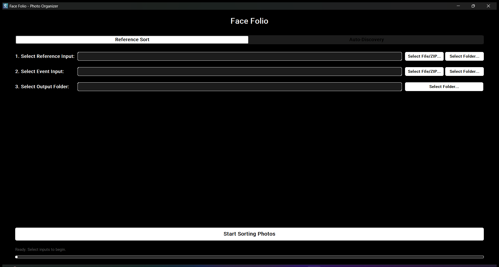

# Face Folio: Automated Photo Organizer

A Digital Image Processing application that automatically sorts event photos into folders by recognized faces using the [face_recognition](https://github.com/ageitgey/face_recognition) library (powered by dlib).

This application provides two modes:

1.  **Reference Sort:** You provide a folder of reference photos (e.g., `Alice.jpg`, `Bob.png`) and a folder of event photos. The app sorts the event photos into folders named `Alice` and `Bob`.
2.  **Auto-Discovery:** You provide *only* a folder of event photos. The app scans all photos, finds all unique faces, and presents them in an in-app tagging window for you to name. Once you are done tagging, it sorts the entire event folder based on the names you provided.

Unknown faces are copied to a `_NoMatches` folder.



## Table of Contents

  - [About](#about)
  - [Features](#features)
  - [DIP Methodology Focus](#dip-methodology-focus)
  - [Project Structure](#project-structure)
  - [Installation](#installation)
      - [End Users](#end-users)
      - [Developers](#developers)
  - [Building & Distribution](#building--distribution)
  - [Testing & Verification](#testing--verification)
  - [Known Limitations](#known-limitations)
  - [Team](#team)
  - [Technologies](#technologies)
  - [License](#license)
  - [Acknowledgments](#acknowledgments)

-----

## About

Face Folio was developed for the Digital Image Processing (G5A23DIP) course at Rashtriya Raksha University. It uses the `face_recognition` library to generate 128-d face embeddings and sorts photos by matching faces.

### Core Flows

**1. Reference Sort Mode**

1.  Load reference images (e.g., `Name.jpg`) from a Reference Input (folder, file, or ZIP).
2.  Scan an Event Input (folder, file, or ZIP) for photos.
3.  For each event photo, detect all faces and compute their 128-d embeddings.
4.  Compare event photo embeddings to the reference database (Euclidean distance). If below the tolerance threshold (`0.65`), copy the photo to that person's folder; otherwise, copy it to `_NoMatches`.

**2. Auto-Discovery Mode**

1.  Scan an Event Input (folder, file, or ZIP) for photos.
2.  For each photo, detect all faces and compute embeddings.
3.  Compare embeddings against an internal list of "seen" faces. If a face is new (distance \> `0.65`), save a cropped portrait of it to a `_Portraits_To_Tag` folder.
4.  Once scanning is complete, the GUI displays the saved portraits one-by-one, allowing the user to enter a name for each face or skip.
5.  After the user finishes tagging, the app runs the **Reference Sort** process, using the newly-tagged portraits as the reference database.

## Features

  - Face recognition via [face_recognition](https://github.com/ageitgey/face_recognition) (using dlib's ResNet model)
  - **Dual-mode operation:** "Reference Sort" for pre-existing tags and "Auto-Discovery" for new events
  - **In-app tagging UI** for naming faces found during Auto-Discovery
  - Automated sorting of large photo collections
  - Support for Folders, individual Images, and **ZIP archives** as inputs
  - GUI built with [CustomTkinter](https://github.com/TomSchimansky/CustomTkinter)
  - Asynchronous processing to keep the UI responsive
  - Local processing for privacy (dlib models are downloaded on first run)

## DIP Methodology Focus

  - **Task:** Object recognition (faces) implemented as face verification.
  - **Model:** `face_recognition` library, which uses:
      - **Face Detection:** HOG (Histogram of Oriented Gradients) based model.
      - **Face Embeddings:** A deep ResNet model (trained on `dlib`'s 5-point face landmarks) to generate 128-d face embeddings (vectors) for each face.
  - **Decision rule:** Euclidean distance between 128-d embeddings. A match is declared if the distance is below a set tolerance. This project uses a tolerance of **`0.65`** (default is 0.6).
  - **Implementation:** `face_recognition` APIs (e.g., `face_recognition.face_encodings()`, `face_recognition.compare_faces()`).

## Project Structure

```
Face_Folio/
│
├── main.py
├── requirements.txt
│
├── src/
│   ├── core/
│   │   └── photo_organizer.py
│   └── ui/
│       └── main_window.py
│
├── assets/
│   ├── app_logo.ico
│   └── app_logo.png
│
├── installer/
│   ├── installer_ui.py
│   ├── uninstaller_ui.py
│
└── dist/
```

## Installation

### End Users

Download and run the built installer: [FaceFolio-Setup-v1.0.exe](dist/FaceFolio-Setup-v1.0.exe). No Python required. The dlib face recognition models will be downloaded automatically on the first run.

### Developers

Clone and run from source:

```powershell
git clone https://github.com/JAMPANIKOMAL/Face_Folio.git
cd Face_Folio
python -m venv venv
.\venv\Scripts\activate

pip install -r requirements.txt

python main.py
```

Notes:

  - Python 3.7+: https://www.python.org/
  - `face_recognition` repo & docs: https://github.com/ageitgey/face_recognition
  - Installing `dlib` from source on Windows requires a C++ build toolchain
    (Visual Studio Build Tools + CMake). To skip that, install the prebuilt
    [`dlib-bin`](https://pypi.org/project/dlib-bin/) package instead
    (`pip install dlib-bin`), then `pip install face_recognition --no-deps
    face-recognition-models` — this is the exact combination verified to
    work in a clean Python 3.11 environment with no build tools installed.

## Building & Distribution

This is a 3-step process. Run these commands from the project root after activating your `venv`. See [PyInstaller docs](https://pyinstaller.org/) for details.

### Step 1 — Build main app bundle

This command packages the Python application and its dependencies into a single folder.

```powershell
# From project root with venv activated
pyinstaller --noconsole --onedir --name FaceFolio --paths "src" --add-data "assets;assets" --hidden-import "tkinter" --hidden-import "face_recognition" --hidden-import "dlib" --collect-all "customtkinter" --collect-all "numpy" --collect-all "PIL" --collect-all "face_recognition_models" --icon "assets/app_logo.ico" main.py
```

Output: `dist/FaceFolio` folder.

### Step 2 — Build uninstaller

This command creates a standalone uninstaller executable.

```powershell
pyinstaller --noconsole --onefile --name Uninstall --icon assets/app_logo.ico --collect-all customtkinter uninstall.py
```

Output: `dist/Uninstall.exe`.

### Step 3 — Build the complete setup installer

This command packages the app bundle and uninstaller into a single-file setup wizard (`.exe`). You must run Steps 1 & 2 first.

```powershell
pyinstaller --noconsole --onefile --name FaceFolio-Setup-v1.0 --icon assets/app_logo.ico --add-data "dist/FaceFolio;FaceFolio" --add-data "dist/Uninstall.exe;." --add-data "assets/app_logo.ico;." installer/installer_ui.py
```

Output: `dist/FaceFolio-Setup-v1.0.exe`.

## Testing & Verification

The core sorting logic (`src/core/photo_organizer.py`) was verified end-to-end
by calling `run_reference_sort` and `run_auto_discovery` directly with real
photos (two different people's official public-domain portraits) rather than
just launching the GUI:

  - **Reference Sort:** given two reference photos (`Obama.jpg`, `Biden.jpg`)
    and two matching event photos, each event photo was correctly copied into
    its matching person's output folder — no misclassifications, no false
    `_NoMatches`.
  - **Auto-Discovery:** given the same two event photos with no reference
    input, the app correctly identified 2 distinct unique faces and saved 2
    separate portraits to `_Portraits_To_Tag` (did not merge them into one
    person or split one person into two).
  - The GUI itself was also launched and driven directly (filling the real
    input fields and clicking "Start Sorting Photos"), confirming the full
    pipeline from UI to disk output works, not just the underlying functions.

There is no automated test suite in this repository — the checks above were
run manually. Adding a `pytest` suite would require bundling real, identifiable
face photos as fixtures, which raises its own attribution/privacy questions;
left as a known gap rather than doing that.

## Known Limitations

  - No automated test suite (see Testing & Verification above for how this
    was actually verified).
  - The face-match tolerance (`0.65`) is a hardcoded constant in
    `photo_organizer.py`, not exposed as a UI setting.
  - Auto-Discovery's "seen faces" list only exists for the duration of one
    run — there is no persistent face database across separate runs.
  - Not tested on macOS or Linux, despite `face_recognition`/`dlib` being
    cross-platform in principle; the installer/uninstaller are Windows-only
    (PyInstaller `.exe` + Windows Registry entries).

## Team

Primary Developer: Jampani Komal

Academic Year: 2024–2025

## Technologies

  - [Python](https://www.python.org/)
  - [face_recognition](https://github.com/ageitgey/face_recognition)
  - [dlib](http://dlib.net/)
  - [CustomTkinter](https://github.com/TomSchimansky/CustomTkinter) (GUI)
  - [PyInstaller](https://pyinstaller.org/) (packaging)

## License

MIT License — see [LICENSE](LICENSE).

## Acknowledgments

  - `face_recognition` contributors — https://github.com/ageitgey/face_recognition
  - `dlib` developer — http://dlib.net/
  - CustomTkinter developers — https://github.com/TomSchimansky/CustomTkinter